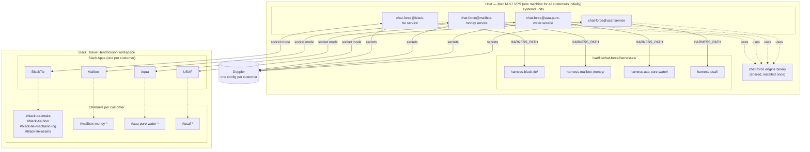
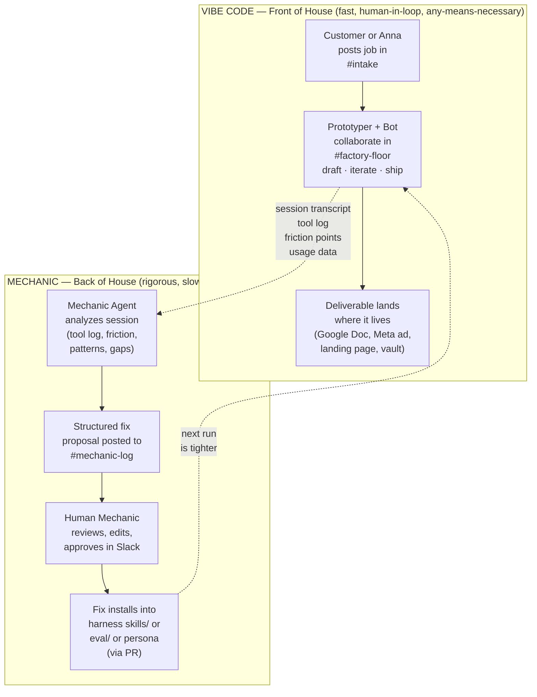
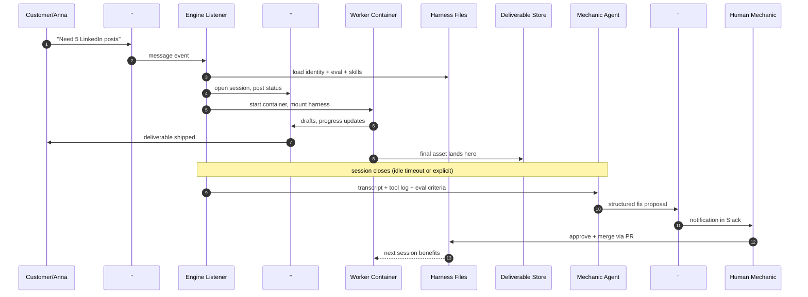

# chat-force Architecture

Four views of the same system. Read in order — each builds on the previous.

---

## View 1 — Deployment Topology (where things physically live)

One host. One Slack workspace. N bots, each as a separate process. N harnesses on disk.

**Mental model:** one binary, many units. Adding customer #5 = create harness repo, add systemd unit, add Doppler config, create Slack App. No code changes.

---

## View 2 — Engine vs Harness (what lives where)

This is the single most important split. Everything in the engine is shared across all customers. Everything in the harness is that customer's alone. Get this wrong and nothing else works.

```mermaid
flowchart LR
  subgraph Engine["FACTORY ENGINE — chat-force repo (ONE copy, shared by all customers)"]
    direction TB
    E1["pipeline/<br/>session manager<br/>worker manager<br/>mechanic manager<br/>PR creator<br/>slack listener"]
    E2["worker/<br/>Dockerfile<br/>entrypoint.py"]
    E3["mechanic/config/<br/>how-to-review logic<br/>(universal)"]
    E4["tests/<br/>mechanical checks<br/>CI"]
    E5["HarnessLoader<br/>(reads + validates)"]
  end

  subgraph Harness["CUSTOMER HARNESS — harness-&lt;slug&gt; repo (ONE per customer)"]
    direction TB
    H1["workspace.yaml<br/>bot identity · git identity<br/>channels · access · limits<br/>secrets refs · deliverables"]
    H2["identity/<br/>mission.md<br/>brand.md<br/>avatar.md<br/>never-list.md<br/>bot-persona.md"]
    H3["eval/criteria.yaml<br/>WHAT good looks like<br/>(customer's definition)"]
    H4["skills/<br/>grown by the factory<br/>over time"]
    H5["brand-assets/<br/>logos, URLs, references,<br/>past campaigns"]
    H6["mechanic-log/<br/>structured fix log<br/>(the moat — compounds)"]
  end

  Engine -->|"HARNESS_PATH env var<br/>points engine at one harness"| Harness
```

**The two halves of review:**
- **Eval** = WHAT the customer wants (harness, customer-authored)
- **Mechanic** = HOW to build and review it (engine, universal)

**The two sources of harness content:**
- **Customer-authored** (mission, brand, avatar, eval criteria) — rarely changes
- **Factory-grown** (skills, mechanic-log entries, refined prompts) — grows every session

---

## View 3 — The Two Loops (Vibe Code + Mechanic)

The core insight of the whole system. Vibes allowed in front, mechanics enforced in back.

**Three distinct 'mechanic' roles — do not conflate:**

| Role | What it does | Where it lives |
|------|--------------|----------------|
| **Automated Eval** | Runs mechanical checks (regex, URL-check, LLM-judge) on every output before it ships | Engine code + `eval/criteria.yaml` in harness |
| **Mechanic Agent** | The AI that analyzes sessions and *proposes* fixes | Engine (`mechanic/config/`) + uses harness eval criteria as input |
| **Human Mechanic (you)** | Reviews proposed fixes in `#mechanic-log`, approves installations | You, in Slack |

Only the Human Mechanic can install fixes. The Agent proposes, never commits.

---

## View 4 — One Session End-to-End

A single message from Slack through to deliverable, with the mechanic-log entry that comes after.

**Key property:** the deliverable flows on the left (customer side, fast). The fix flows on the right (factory side, compounding). They never block each other.

---

## Summary — Three Principles This Architecture Enforces

1. **Vibes up front, mechanics behind.** Prototyping is human-speed and freeform. Quality is enforced mechanically, separately, after the fact.

2. **Engine is universal, harness is unique.** One engine serves N customers. Every customer has exactly one harness. Knowledge transfer between customers is a manual operation by the human mechanic, not an engine feature.

3. **Changes compound in the harness, not the engine.** Every caught mistake becomes a permanent improvement to that customer's harness. The engine only changes when you improve the factory itself — not on a per-customer basis.
