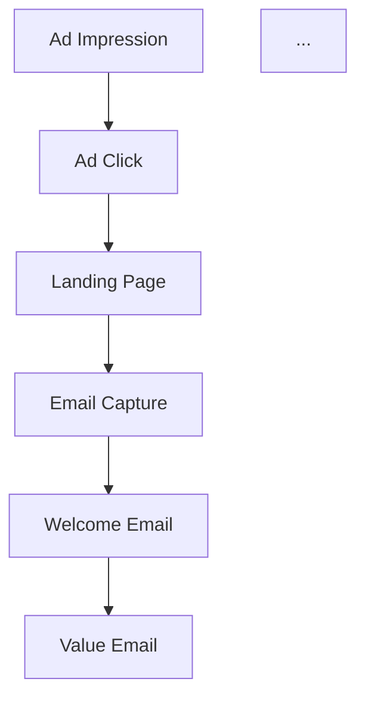

# Ad Campaign Generation

You are executing the generation phase of an ad campaign. You have an approved concept from the research phase. Your job is to produce a complete, multi-channel campaign package ready for review.

**Nothing you produce ships without Travis's explicit approval.**

---

## Input

- An approved campaign concept (from ad-campaign-research)
- The research findings that support it
- Product details, audience, and constraints from the original brief

## Output

A complete campaign package containing all deliverables listed below, presented on a review page for Travis's approval.

---

## Step 1: Plan the Campaign Structure

Before generating anything, map the full campaign architecture:

### Channel Map
Define how the hook translates across each channel:
- **Paid Social** (Meta, Google): awareness + traffic
- **Email**: nurture + convert
- **SMS**: urgency + action
- **Landing Page**: full pitch + conversion

### Audience Segments
For each target segment identified in research:
- How does the hook angle differ?
- What specific pain/desire resonates most?
- What awareness level are they at?

### Conversion Flow
Map the complete journey: Ad impression -> Ad click -> Landing page -> Email capture -> Drip sequence -> Conversion

Document this as a Mermaid flow diagram.

## Step 2: Generate Ad Copy

For each segment, for each platform, produce 3+ variants.

### Ad Copy Format
```
## [Segment] — [Platform] — Variant [N]

**Headline**: [max 40 chars for Meta, 30 for Google]
**Body**: [max 125 chars primary text for Meta, varies for Google]
**CTA**: [action phrase]
**Angle**: pain | aspiration | social proof | urgency | curiosity

### Why This Works
[1 sentence connecting to research finding]
```

### Platform Specs
- **Meta Feed**: Headline 40 chars, primary text 125 chars, description 30 chars
- **Meta Stories**: Headline 40 chars, keep text minimal (visual-first)
- **Google Search**: Headline 30 chars x3, description 90 chars x2
- **Google Display**: Headline 30 chars, description 90 chars

### Copy Principles (non-negotiable)

- **Each sentence's only job is to get the next sentence read.** Copy is a slippery slope — every element must pull the reader forward. (Sugarman, Schwartz)
- **Sell the transformation, not the product.** People buy better versions of themselves. Frame everything around the after-state. (Hopkins, Collier, Halbert)
- **Use the customer's language, not the company's.** No jargon. Write the way the customer talks when complaining to a friend. (Ogilvy, Halbert)
- **Specificity is credibility.** "A 78-second shave" beats "a fast shave." Specific claims imply testing. (Hopkins, Caples)
- **Story beats exposition.** Stories bypass rational resistance and are remembered far longer than bullet points. (Halbert, Collier)
- **Resolve every objection before it forms.** Raise objections before the prospect does. Address them head-on. (Sugarman, Halbert)
- **Tell them exactly what to do.** One CTA, not three. (Collier, Kennedy)

### Vary the Angles
Across the 3+ variants, hit different psychological triggers:
- **Pain**: "Stop losing $X/month to..."
- **Aspiration**: "Imagine waking up to..."
- **Social proof**: "Join 10,000+ who already..."
- **Urgency**: "Before [date], you can still..."
- **Curiosity**: "The [counterintuitive thing] about..."

## Step 3: Generate Image Prompts

For each ad variant that needs a visual, create an image generation prompt.

### Prompt Requirements
- Specify style, mood, color palette, composition
- Include the product/subject clearly
- Describe the emotional state of any people in the image
- Specify platform dimensions (1080x1080 feed, 1080x1920 story, etc.)
- Save every prompt — these are needed for surgical edits later

### Prompt Format
```
## Image Prompt: [Segment] — [Platform] — Variant [N]

**Style**: [photorealistic | illustrated | minimal | lifestyle]
**Mood**: [aspirational | urgent | warm | professional]
**Subject**: [what's in the image]
**Composition**: [layout, focal point, negative space for text]
**Color Palette**: [primary colors, brand alignment]
**Dimensions**: [WxH]
**Text Overlay**: [any text that should appear on the image]

**Full Prompt**:
[Complete prompt ready for Gemini/Imagen]
```

### Visual Principles
- **The 2-second test**: If the visual can't communicate its core message at a glance, it gets scrolled past.
- **One ad, one message**: Multiple messages dilute all of them. One visual, one headline, one message, one CTA. (Reeves)
- **Show, don't tell**: Less than 20% text on images. The visual should make you feel something before you read a word.
- **Mobile-first**: Design for thumb-scrolling, small screens, vertical formats first.
- **Faces and eyes create connection**: Human brains notice faces faster than anything else. Use faces when appropriate.

## Step 4: Build Email Drip Sequence

5 emails, each building on the previous:

### Email 1: Welcome
- Subject line (A/B variants)
- Acknowledge how they arrived (ad/landing page reference)
- Deliver immediate value (promised lead magnet, insight, or tool)
- Set expectations for the sequence
- Soft CTA to explore

### Email 2: Value
- Subject line (A/B variants)
- Teach something useful related to the core pain/desire
- Position the product as the natural next step (don't hard sell)
- Include a story or case study
- CTA to learn more

### Email 3: Social Proof
- Subject line (A/B variants)
- Customer testimonials, results, or case studies
- Specific numbers and outcomes
- Address the #1 objection
- CTA to try/buy

### Email 4: Urgency
- Subject line (A/B variants)
- Create legitimate scarcity or time pressure (only if real)
- Recap the transformation on offer
- Stack the value (everything they get)
- Direct CTA to purchase

### Email 5: Final CTA
- Subject line (A/B variants)
- Last chance framing
- Summarize the full journey (pain -> solution -> proof -> offer)
- Clear, single CTA
- P.S. with final hook

### Email Requirements
- Complete HTML with inline CSS (no external stylesheets)
- Mobile-responsive (single column, large tap targets)
- A/B subject lines for each email
- Preheader text for each email
- Consistent branding and tone across the sequence
- Each email stands alone (recipient may have missed previous ones)
- Unsubscribe link placeholder

## Step 5: Build SMS Sequence

3 messages timed to complement the email sequence:

### SMS 1: Introduction (Day 1, after email 1)
- Max 160 characters
- Reference the value delivered in email 1
- Include link to landing page or offer

### SMS 2: Value Reminder (Day 3, after email 3)
- Max 160 characters
- Reference social proof or key benefit
- Include link

### SMS 3: Urgency (Day 5, after email 4)
- Max 160 characters
- Time-sensitive CTA
- Include link

### SMS Requirements
- Under 160 characters each (single SMS, no splitting)
- Include opt-out language placeholder
- Natural, conversational tone (not corporate)
- Each message makes sense standalone

## Step 6: Build Landing Page

A standalone HTML landing page that follows this structure:

### Page Structure
1. **Hero**: Headline (the hook), subheadline, hero image, primary CTA
2. **Problem**: Agitate the pain — use customer language from research
3. **Solution**: Introduce the product as the answer
4. **Benefits**: 3-5 key benefits with icons/images (not features — outcomes)
5. **Social Proof**: Testimonials, logos, numbers, case studies
6. **Objection Handling**: FAQ or direct objection resolution
7. **CTA Section**: Recap offer, stack value, clear CTA button
8. **Footer**: Legal, links, trust signals

### Landing Page Requirements
- Complete standalone HTML (no external dependencies except CDN fonts/icons)
- Mobile-responsive
- Fast loading (no heavy assets, use CDN images)
- Clear visual hierarchy: hook -> proof -> CTA
- Single conversion goal (one CTA, repeated in multiple positions)
- Form or button above the fold
- Trust signals near the CTA (guarantees, security, reviews)

## Step 7: Create Campaign Flow Diagrams

Use Mermaid syntax to document:

### Full Campaign Flow


### Email Sequence Timeline
```mermaid
gantt
    title Email + SMS Sequence
    ...
```

Include the Mermaid CDN script in the HTML so diagrams render in-browser.

## Step 8: Quality Verification

Before presenting to Travis, run through every item:

### Completeness
- [ ] All segments have 3+ ad variants per platform
- [ ] All platforms have correctly-sized image prompts
- [ ] Email sequence has 5 complete HTML emails
- [ ] SMS sequence has 3 messages under 160 chars
- [ ] Landing page is complete and standalone
- [ ] Flow diagrams cover all sequences

### Messaging Consistency
- [ ] Same core hook appears in ads, landing page, emails, SMS
- [ ] Tone is consistent across all touchpoints
- [ ] CTA language is consistent
- [ ] Segment variations are meaningfully different (not just word swaps)

### Technical Quality
- [ ] All HTML is valid and renders correctly
- [ ] Landing page is mobile-responsive
- [ ] Email HTML uses inline CSS only
- [ ] No placeholder text remaining ("[TODO]", "lorem ipsum", etc.)
- [ ] Mermaid diagrams render (CDN script included)

### Principles Alignment
- [ ] Does every piece sell the feeling of the problem solved?
- [ ] Would you stop scrolling for these headlines?
- [ ] Is the copy specific (numbers, timeframes, outcomes)?
- [ ] Is customer language used, not corporate jargon?
- [ ] Does each ad have one clear message and one clear CTA?
- [ ] Are objections addressed in the landing page and emails?
- [ ] Is the campaign a multi-touch sequence, not a single shot?
- [ ] Is it honest? Would you show it to a skeptical friend?

---

## The 10 Laws of Advertising

These are non-negotiable. Every piece of output must align.

1. **Advertising is salesmanship** — every element must advance the sale. (Hopkins, Ogilvy)
2. **You cannot create desire — only channel it** — find existing desire through research and aim it. (Schwartz)
3. **Know the awareness level** — copy must match where the prospect is. (Schwartz)
4. **The headline is 80% of the ad** — invest disproportionate effort. (Ogilvy, Caples)
5. **Enter the conversation already in the customer's mind** — start where they are. (Collier)
6. **Be specific, never vague** — numbers, timeframes, concrete outcomes. (Hopkins, Caples)
7. **Lead with emotion, justify with logic** — feel first, prove second. (Collier, Sugarman)
8. **Every ad needs a clear USP** — unique and powerful enough to move people. (Reeves)
9. **Research is non-negotiable** — understand market, customer, competition first. (Ogilvy, Halbert)
10. **Match the message to market sophistication** — new mechanism for saturated markets. (Schwartz)

---

## Strategy Principles

- **Positioning is what you do to the mind, not the product.** Claim a specific place in the prospect's mental landscape. (Ries, Trout)
- **Own a word in the prospect's mind.** Distill to one word or phrase and reinforce relentlessly. (Ries, Trout)
- **The follow-up is where the money is.** Most sales happen after the 5th-7th contact. Design multi-touch sequences. (Kennedy)
- **Direct response first, brand as bonus.** Clear offer, clear CTA, trackable results. Let brand equity accrue as a byproduct. (Kennedy, Hopkins)
- **Test the big things first.** Headline changes produce 5-10x differences. Button colors produce 5-10%. (Caples, Kennedy)

---

## Approval Gate

Present the complete campaign package to Travis for review.
- Travis reviews all deliverables before any deployment
- Nothing ships without explicit "approved" or "ship it"
- Travis may request revisions to specific pieces
- Do not deploy, publish, or push anything externally
